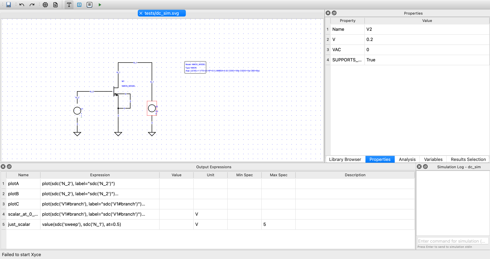

# OpenS

[](https://github.com/SeimSoft/OpenS/actions/workflows/ci.yml)
[](https://github.com/SeimSoft/OpenS/actions/workflows/ci.yml)
[](https://seimsoft.github.io/OpenS/)
[](https://seimsoft.github.io/OpenS/)
[](https://seimsoft.github.io/OpenS/)


A PyQt6 application for Schematic Entry.





## Installation

```markdown
### Prerequisites

- brew install python@3.14 (Required for Xyce)
- brew install gcc@14 (Required for Xyce)
- uv (Recommanded for package management)
```


```bash
uv pip install -e .
# or
pip install -e .
```

## Running

```bash
opens
```
